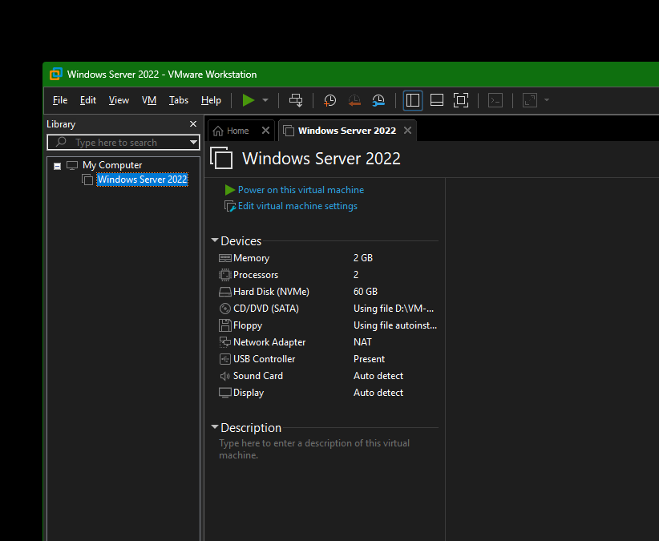
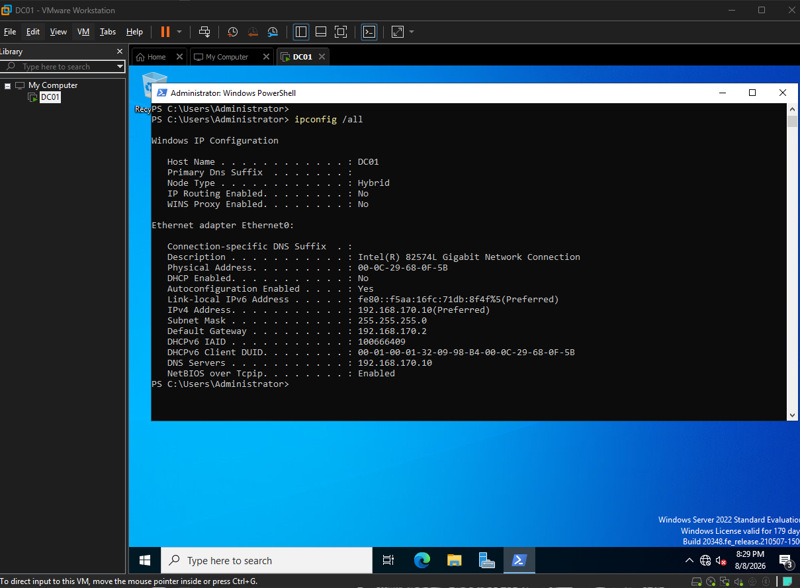
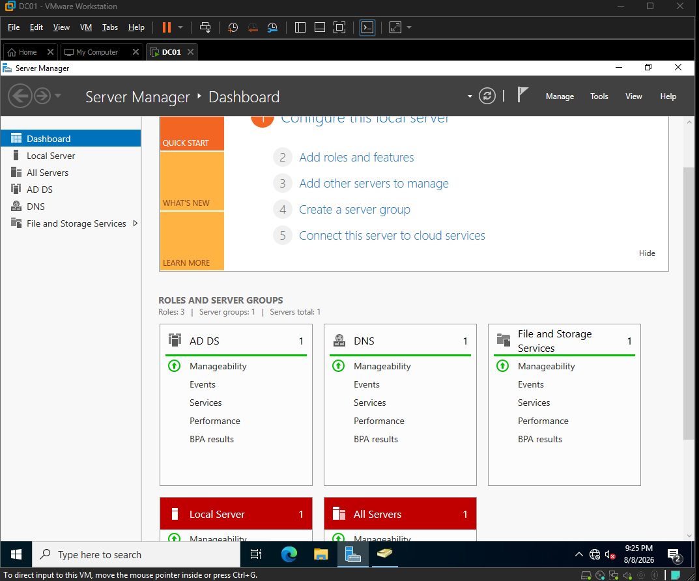
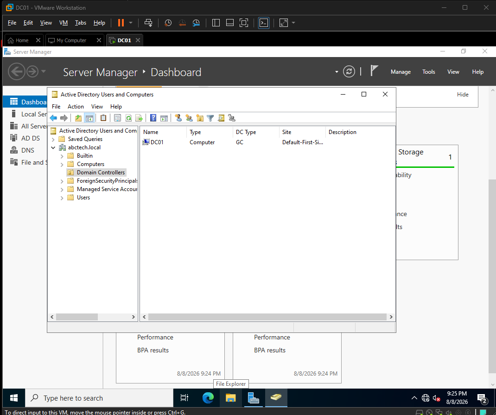
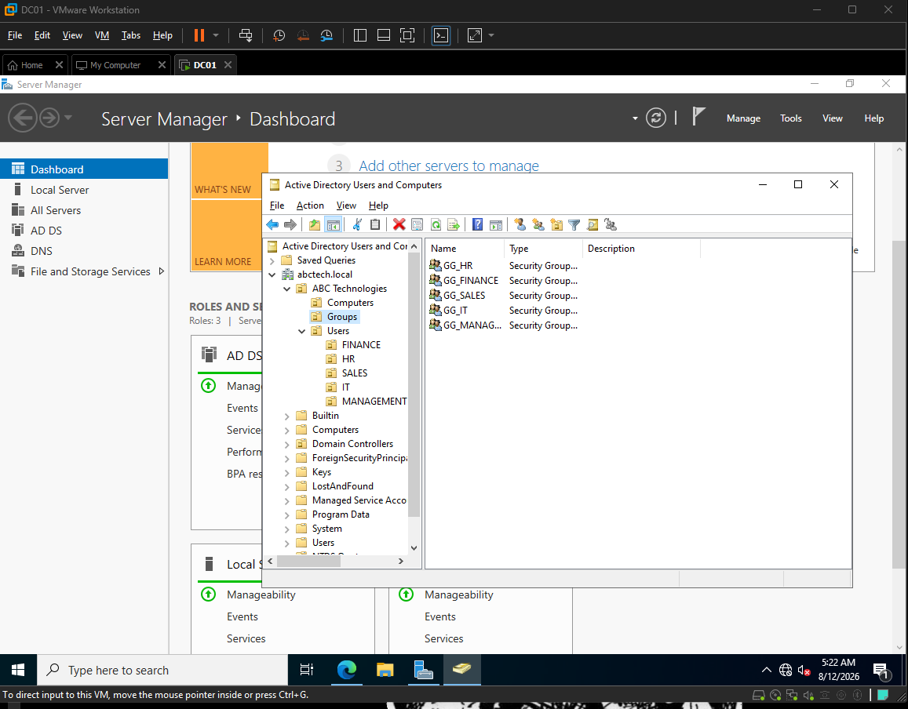
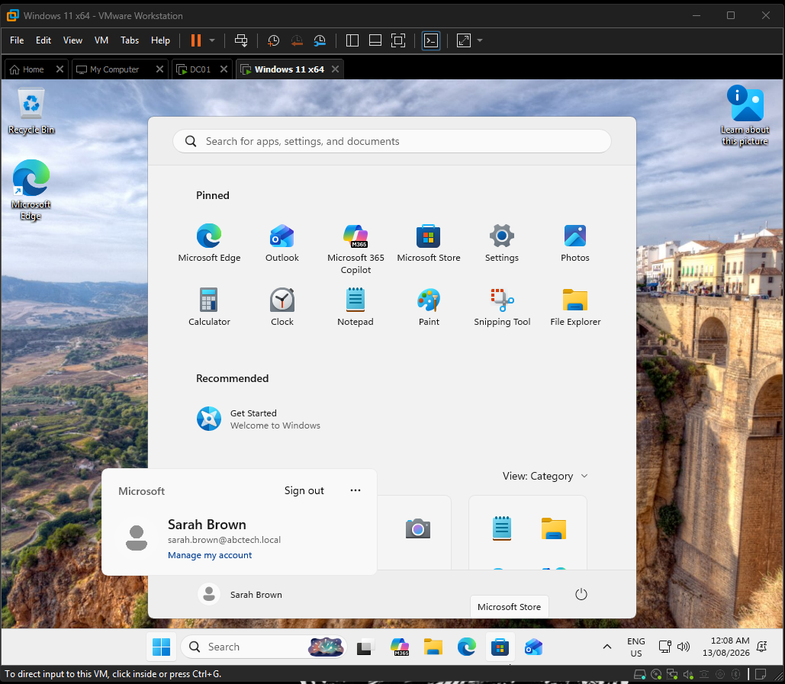
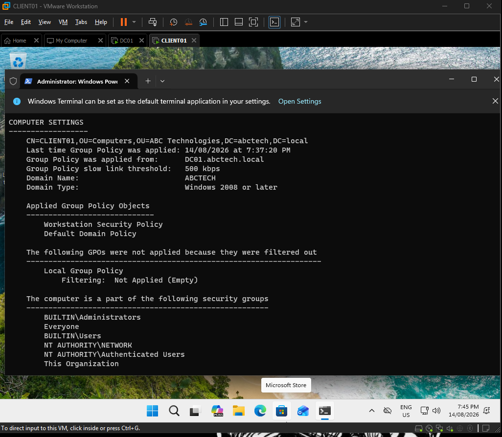
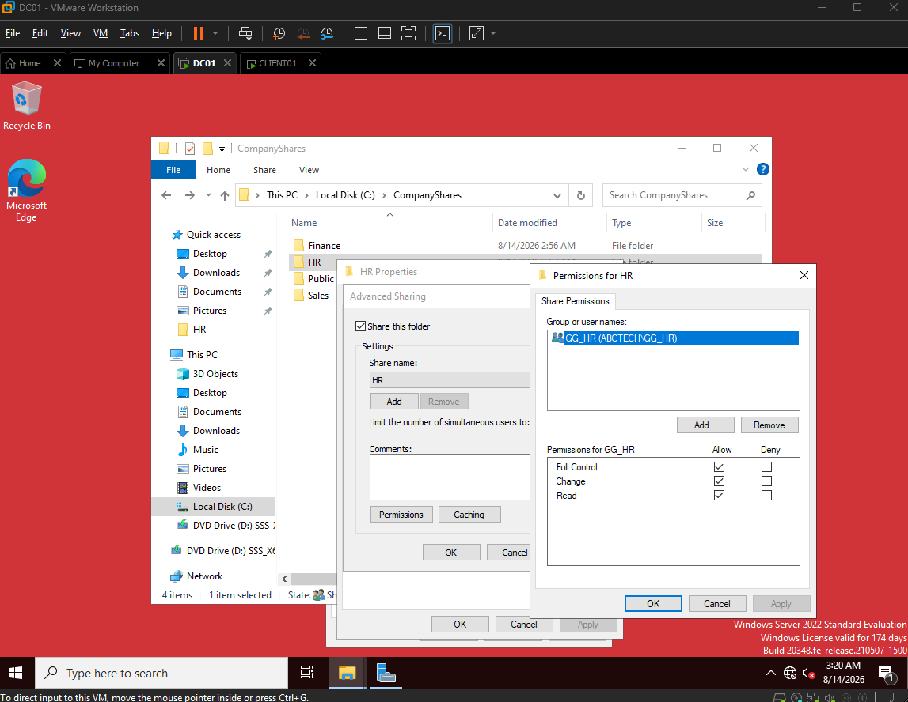
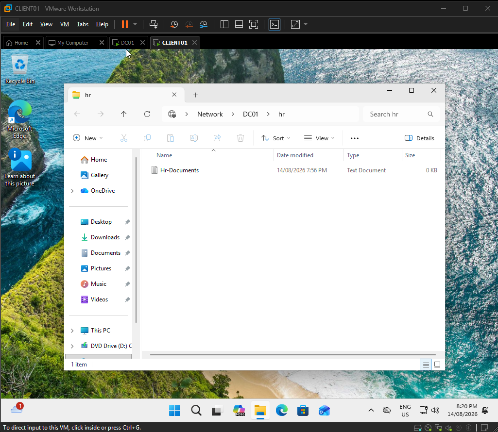

# Active Directory Enterprise Lab

A hands-on enterprise Active Directory lab built using **Windows Server 2022, Windows 11 Pro, VMware Workstation, Active Directory Domain Services (AD DS), DNS, Group Policy, and Windows file sharing**.

The project simulates a small business IT environment for **ABC Technologies**, where users, computers, security policies, authentication, and departmental resources are centrally managed through Active Directory.

---

## Project Overview

The goal of this project was to build a functional Windows domain environment from the ground up and gain practical experience with technologies commonly used in IT Support, Desktop Support, System Administration, and enterprise Windows environments.

The completed environment includes:

- Windows Server 2022 Domain Controller
- Active Directory Domain Services
- Internal DNS
- Windows 11 domain-joined workstation
- Organizational Units (OUs)
- Domain users and security groups
- Group Policy
- Department-based file sharing
- Group-based access control
- Active Directory troubleshooting

---

## Lab Architecture

```text
                     VMware Workstation
                            |
                   192.168.170.0/24
                            |
             +--------------+--------------+
             |                             |
           DC01                         CLIENT01
     192.168.170.10                       DHCP
     Windows Server 2022              Windows 11 Pro
             |                             |
       +-----+-----+                       |
       |           |                       |
     AD DS        DNS <--------------------+
       |
  abctech.local
       |
  +----+-------------------------+
  |              |               |
 Users          Groups           OUs
  |              |               |
  +------- Access Control -------+
                 |
          Department Shares
```

### Core Network Configuration

| Component | Configuration |
|---|---|
| Domain | `abctech.local` |
| Domain Controller | `DC01` |
| DC01 IP | `192.168.170.10` |
| Subnet | `192.168.170.0/24` |
| Default Gateway | `192.168.170.2` |
| DNS Server | `192.168.170.10` |
| Client | `CLIENT01` |
| Client Addressing | DHCP |

---

## 1. Windows Server Deployment

I deployed a Windows Server 2022 virtual machine using VMware Workstation to provide the foundation for the domain environment.

The server was renamed **DC01** and prepared to become the first Domain Controller for ABC Technologies.



---

## 2. Static IP and DNS Configuration

Before deploying Active Directory, I configured DC01 with the static IPv4 address:

`192.168.170.10/24`

The server uses the VMware NAT gateway at `192.168.170.2`.

DC01 was configured to use itself as its DNS server in preparation for hosting Active Directory-integrated DNS.



A static address ensures that domain clients have a predictable location for DNS and Active Directory services.

---

## 3. Active Directory Domain Services and DNS

I installed the **Active Directory Domain Services (AD DS)** and **DNS Server** roles on DC01.

The server was then promoted to the first Domain Controller in a new forest:

`abctech.local`



After promotion, I verified the domain through Active Directory Users and Computers and confirmed that **DC01** appeared in the Domain Controllers container.



---

## 4. Organizational Units, Users and Security Groups

I created an Active Directory structure representing different departments within ABC Technologies.

```text
ABC Technologies
|
+-- Users
|   +-- HR
|   +-- Finance
|   +-- Sales
|   +-- IT
|   +-- Management
|
+-- Computers
|
+-- Groups
```

Security groups were created for departmental access control:

- `GG_HR`
- `GG_FINANCE`
- `GG_SALES`
- `GG_IT`
- `GG_MANAGEMENT`



Instead of assigning resource permissions directly to individual users, users are placed into security groups and permissions are assigned to those groups.

This makes access easier to manage as employees join, leave, or move between departments.

---

## 5. Windows 11 Domain Join and Authentication

I deployed a Windows 11 Pro workstation named:

`CLIENT01`

CLIENT01 receives its IP configuration through DHCP while using **DC01 (`192.168.170.10`) as its DNS server**.

The workstation was joined to:

`abctech.local`

I then verified domain authentication by signing into CLIENT01 using the Active Directory account:

`ABCTECH\sarah.brown`



This confirmed that CLIENT01 could communicate with the Domain Controller and authenticate users through Active Directory.

---

## 6. Group Policy

To demonstrate centralized workstation management, I created:

`Workstation Security Policy`

The GPO configures a **10-minute machine inactivity limit** for company workstations.

The policy was linked to the Computers OU containing CLIENT01.

On CLIENT01, I forced a policy refresh using:

```powershell
gpupdate /force
```

I then verified the applied policies using:

```powershell
gpresult /r
```



The output confirmed that CLIENT01 successfully received the **Workstation Security Policy** from `DC01.abctech.local`.

---

## 7. Department File Shares and Access Control

Departmental shared folders were created on DC01:

```text
C:\CompanyShares\
|
+-- HR
+-- Finance
+-- Sales
+-- Public
```

Access was controlled through Active Directory security groups.

For example:

```text
Sarah Brown
     |
     v
   GG_HR
     |
     v
 HR Shared Folder
```

The HR share was configured to allow the `GG_HR` security group to access the resource.



From CLIENT01, an authorized HR user was able to access:

`\\DC01\HR`



Users outside the appropriate departmental security group were restricted from accessing that department's resources.

---

## Troubleshooting Scenarios

After completing the environment, I worked through several simulated Service Desk incidents.

### Account Lockout

**Issue:** An HR employee entered an incorrect password several times and could no longer authenticate.

**Approach:**

1. Located the user account in Active Directory Users and Computers.
2. Checked whether the account was locked.
3. Unlocked the account when appropriate.
4. If the password was forgotten, reset it using a temporary password.
5. Required the user to change the temporary password at the next sign-in.

---

### New Employee Provisioning

**Scenario:** A new Finance employee required a domain account and access to Finance resources.

**Solution:**

1. Created the user in the Finance OU.
2. Configured the employee's domain account.
3. Added the user to `GG_FINANCE`.
4. Verified Finance resource access.
5. Confirmed the user did not receive HR access.

This demonstrated group-based access management rather than assigning permissions directly to individual users.

---

### Domain Connectivity / DNS Failure

**Issue:** CLIENT01 could no longer contact the domain after its DNS server was incorrectly changed to `8.8.8.8`.

I first inspected the client's network configuration:

```powershell
ipconfig /all
```

I then tested connectivity to the Domain Controller:

```powershell
ping 192.168.170.10
```

The DNS configuration was corrected to:

`192.168.170.10`

The DNS cache could then be cleared using:

```powershell
ipconfig /flushdns
```

Finally, domain name resolution was verified with:

```powershell
nslookup abctech.local
```

This scenario reinforced the importance of DNS in Active Directory environments.

---

## Technologies Used

| Technology | Purpose |
|---|---|
| VMware Workstation | Virtualization platform |
| Windows Server 2022 | Server operating system |
| Windows 11 Pro | Domain client workstation |
| Active Directory Domain Services | Centralized identity and domain management |
| DNS | Domain name resolution and AD service discovery |
| Group Policy | Centralized workstation configuration |
| PowerShell / Command Prompt | Administration and troubleshooting |
| SMB File Sharing | Department resource sharing |
| NTFS / Share Permissions | Resource access control |

---

## Skills Demonstrated

This project provided hands-on experience with:

- Windows Server administration
- Active Directory Domain Services
- Domain Controller deployment
- DNS configuration
- Static IPv4 configuration
- Windows domain joining
- Active Directory users and computers
- Organizational Units
- Security groups
- Group-based access control
- Group Policy creation and deployment
- Windows file sharing
- Share and NTFS permissions
- Domain authentication
- User account administration
- Basic PowerShell administration
- DNS troubleshooting
- Group Policy verification
- Service Desk troubleshooting methodology

---

## Key Takeaways

This project helped me understand how the individual components of a Windows enterprise environment work together.

In particular, I gained practical experience with the relationship between:

```text
DNS
 |
 v
Active Directory
 |
 v
Users + Computers
 |
 v
Security Groups
 |
 v
Group Policy + Resource Permissions
```

Rather than only studying Active Directory theoretically, this lab allowed me to deploy the infrastructure, configure users and devices, apply policies, control resource access, and troubleshoot realistic issues from both the server and client side.

---

## Build This Lab Yourself

A separate step-by-step guide for recreating this environment is available here:

**[Active Directory Lab Build Manual](MANUAL.md)**

The manual covers the complete setup from creating the virtual machines through Active Directory, DNS, domain joining, Group Policy, file sharing, permissions, testing, and troubleshooting.

---

## Disclaimer

This project is a **personal training lab built in a virtualized environment** for learning and demonstrating Windows Server and Active Directory administration skills.

It does not represent a production deployment or professional management of ABC Technologies. All company names, users, and scenarios used in the lab are fictional.
